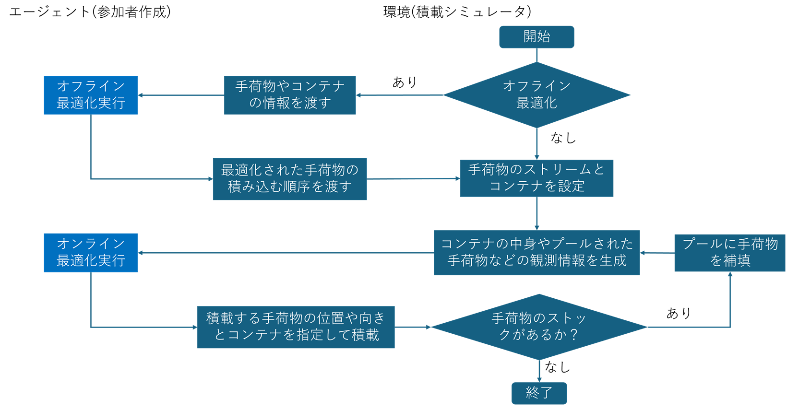

# 概要
この課題はデータサイエンスコンペに挑戦します。
このコンペで優勝するために最適化を行います。
コンペURL:https://user.competition.signate.jp/ja/competition/detail/?competition=0f73f92293664c48b365e08ec15161d9&task=54eb698257344d638111c73d49664ddb&tab=task

# グランドハンドリングシミュレータ環境

本シミュレータは, PyBulletを用いた物理演算ベースの横空きコンテナ積載環境である. GymnasiumのAPIに準拠しており, 提供された観測情報をもとに最適な配置を決定するエージェントを開発することを目的とする.

- PyBullet：物理シミュレーションエンジンを指す
- 物理演算ベース：シミュレータが物理法則に従って状態遷移することを指す
- Gymnasium API：強化学習ライブラリで標準的に用いられる環境インタフェースを指す
- 観測情報（Observation）：エージェントが環境から取得する状態情報を指す
- エージェント：行動を決定するアルゴリズムを指す

## ディレクトリ構成

シミュレータ環境全体のディレクトリ構成は以下の通り.

```bash
simulator
├── agents                 : エージェントモジュールを格納したディレクトリ
│   └── base                 : サンプルモジュール
├── configs                : シミュレーションの設定ファイルを格納したディレクトリ
│   ├── item_params.xlsx     : 手荷物に関する種類とそのパラメータ例
│   └── sample_config.json   : 設定ファイルのサンプル
├── dockerfiles            : Dockerによる環境構築に使われるベースイメージファイルを格納したディレクトリ
│   └── Dockerfile           : 評価基盤を構築するためのDockerファイル
├── figs                   : 画像として保存された図表などを格納したディレクトリ
├── scripts                : シミュレータを実行するためのPythonスクリプトを格納したディレクトリ
│   └── run_test.py          : configの設定の下でシミュレーションを実行するPythonスクリプト
├── src                    : シミュレーションを行うためのモジュールを実装したプログラム
│   └── ground_handling      : コンテナに手荷物を積載していくシミュレーションを実行するためのプログラム一式
├── docker-compose.yml     : 仮想環境を構築するための定義ファイル
├── README.md              : このファイル
└── sample_submit.zip      : 応募用サンプルファイル
```

## シミュレーション環境モジュールの仕様

### 概要

シミュレータは複数のモジュールから構成されており, JSON形式の設定ファイル（例：`config.json`）の値を読み込んで初期化される. `src/ground_handling/env.py`などのソースも参照すること.

設定ファイルは以下のような構造になっている. タスクID（例: `"001"`）の中に各モジュール用の設定が格納される. `configs/sample_config.json`も参照すること.

```json
{
    "001": {
        "containers": {
            "spacing": 2.0,
            "container_list": [
                {
                    "index": 0, "length": 1.0, "width": 1.5, "height": 1.0, 
                    "thickness": 0.02, "require_shelf": false, "buffer": 0.01,
                    "cut_x": 0.3, "cut_y": 0.3, "packed_items": [], "is_prioritized": false
                }
            ]
        },
        "item_stream": {
            "item_list": [
                {
                    "index": 0, "length": 0.2, "width": 0.2, "height": 0.2, "mass": 1.0,
                    "is_prioritized": false, "lateralFriction": 0.8, "rollingFriction": 0.01,
                    "spinningFriction": 0.01, "restitution": 0.0
                }
            ],
            "look_ahead": 5,
            "max_space": 1,
            "visible_pool": []
        },
        "validator": {
            "safety_margin": 0.01,
            "displacement_threshold": 0.9,
            "settle_wait_step": 300,
            "start_z": 0.03
        },
        "camera": {
            "num_containers": 1, "target_pos": [0, 0, 0], "distance": 3.0,
            "yaw": 0, "pitch": 0, "roll": 0, "img_width": 64, "img_height": 64,
            "fov": 60, "near_val": 0.1, "far_val": 10.0
        },
        "action": {
            "keys": {"item_idx": "int", "container_idx": "int", "place_pos": "float", "orientation": "int"},
            "pos_lim": {"low": -100, "high": 100},
            "orientations": [0, 1, 2, 3, 4, 5]
        },
        "agent": {
            "optimize": false,
            "init_timeout": 10.0, "optimization_timeout": 10.0, "policy_timeout": 10.0,
            "allowed_methods": ["get_init_states", "optimize", "policy"]
        },
        "visualizer": {
            "vis": false,
            "camera": { "img_width": 128, "img_height": 128 }
        }
    },
    ...
}

```

各モジュールに対応したkeyは以下の通り.

| モジュール (設定キー) | 主な機能 |
| --- | --- |
| **`containers`**(MultiContainerManager) | ・指定された寸法の横空きコンテナを生成<br>・複数コンテナの配置（オフセット管理）<br>・コンテナ内の荷物状態の保持 |
| **`item_stream`**(ItemStreamManager) | ・手荷物（直方体）の物理プロパティ定義<br>・コンベアのように流れる荷物の順序管理<br>・エージェントが選択可能な「プール」の提供 |
| **`validator`**(PlacementValidator) | ・荷物がコンテナ外にはみ出していないか判定<br>・押し込む軌道上に他の荷物がないか判定<br>・配置直後に荷物が大きく崩れ落ちないか判定 |
| **`camera`**(Camera) | ・エージェントの観測用データとして, デプスマップ（高さ画像）を生成する |
| **`visualizer`**(Camera) | ・デバッグや動作確認用にシミュレーション全体のRGB画像を生成・保存する |
| **`action`**(GroundHandlingEnv, PlacementValidator) | ・エージェントから受け取る行動データの制約とバリデーションを定義 |
| **`agent`**(TimedAgentRunner) | ・エージェント実行時のタイムアウト設定や実行許可メソッドを定義 |

### 座標系と単位について

以下の物理単位と座標系を採用している.

- **単位**: 長さ・座標はすべてメートル`[m]`, 質量はキログラム`[kg]`, 時間は秒`[s]`.
- **座標系 (Z-up 右手系)**:
    - **X軸**: コンテナの幅（左右）方向
    - **Y軸**: コンテナの奥行き（手前〜奥）方向. 開口部（手前）がY座標のマイナス側.
    - **Z軸**: 高さ（上下）方向. Z軸のプラスが上.

### `GroundHandlingEnv` (統合環境)

シミュレーション環境の全体を管理するGymnasium準拠のメインクラス.

| 項目 | 説明 |
| --- | --- |
| **主な機能** | ・各サブモジュールの初期化と管理<br>・エピソードのリセット (`reset`) とステップ実行 (`step`)<br>・エージェントへの観測情報（Observation）の提供<br>・画像データ転送の管理 |
| **渡す情報 (config)** | 全モジュールの設定を含むルートの辞書データ<br>（`containers`, `item_stream`, `camera`, `validator`, `action`, `agent`, `visualizer` などを内包） |

- `render_mode`を"human"にすることでGUIでシミュレーションを確認することができる.
- 実際の動きを終了後に静止画像で確認することもできる.
    1. `"visualizer": { "vis": false }` を `"vis": true` に変更.
    1. "camera"の値で, 撮影条件に関するパラメータを追加([こちら](#camera-デプスマップ--可視化)と同様)
    1. シミュレーションを実行すると、`images/steps/YYYYMMDD_HHMMSS/` ディレクトリにステップごとの画像（鳥瞰図）が保存される.

※ 注意: 画像の保存処理を入れると実行速度が大幅に低下することがある. アルゴリズムの動作確認時のみ有効にし, 大量のテストを回す際や提出前には`false`に戻すことを推奨する.

### `TimedAgentRunner` (エージェント管理)

エージェントの実行時の制限時間や実装すべき機能などを管理する. エージェントの仕様については[後述](#エージェントの仕様).

| 項目 | 説明 |
| --- | --- |
| **主な機能** | ・エージェント実行時のタイムアウト設定や、実行許可メソッドを定義 |
| **渡す情報 (config)** | ・`init_timeout`, `policy_timeout`, `optimization_timeout`: 各メソッド(それぞれインスタンス化時, policy実行時, optimization実行時)の1ステップ呼び出しあたりの制限時間<br>・`allowed_methods`: エージェントが実行可能なメソッド名<br>・`max_mem`: 使用メモリ上限(`[GB]`) |

- 評価基盤では`init_timeout`: 10`[s]`, `policy_timeout`: 8`[s]`, `optimization_timeout`: 180`[s]`, `max_mem`: 12`[GB]`とする.
- 制限時間を超過した場合, 処理は強制的に打ち切られ以下のフォールバックが自動的に実行される.
    - `optimize`タイムアウト時: 荷物の順序は変更されず, 元のストリーム順で進行する.
    - `policy`タイムアウト時: 空間内のランダムな位置・向きを指定した行動を返す.

### `MultiContainerManager` / `Container` (コンテナ管理)

積載対象となるコンテナの生成と状態を管理する.

| 項目 | 説明 |
| --- | --- |
| **主な機能** | ・指定された寸法の横空きコンテナを物理空間に生成<br>・複数コンテナを並べて配置（オフセット管理）<br>・各コンテナ内に積載された荷物の位置・姿勢情報の保持 |
| **渡す情報 (config)** | ・`spacing`: コンテナ間の配置間隔`[m]`<br>・`container_list`: 各コンテナのリスト<br>　└ `index`: 識別ID<br>　└ `length`, `width`, `height`: コンテナの寸法で, `length`:幅(X軸方向, 外寸), `width`: 奥行(Y軸方向, 外寸), `height`: 高さ(Z軸方向, 外寸)<br>　└ `thickness`, `buffer`: 内壁の厚さと高さのバッファ`[m]`<br>　└ `cut_x`, `cut_y`: 開口部の切り欠き寸法`[m]`で, `cut_x`: 幅(X軸方向, 外寸), `cut_y`: 高さ(Z軸方向, 外寸). Y軸方向から見たときのイメージ. GUIモードなどでも確認されたい.<br>　└ `packed_items`: 積載されている手荷物のリスト. 各要素は`Item`に従う.<br>　└ `is_prioritized`: 優先手荷物搭載用か否か <br>　└ `require_shelf`: 内部棚の有無 |

- Y軸がコンテナの奥行方向で, 開口部はY軸マイナス側の状態で生成される.
- 物理空間へ生成された際に各内壁の面から外側へ向かう(単位)法線ベクトル`n_vec`と対応する代表点の座標`points`, コンテナの中心座標`center`, コンテナの有効体積`volume`が計算され生成される.
- 2つ以上のコンテナを生成する場合は原点`(0, 0, 0)`から始まり, X軸方向に`spacing`分の間隔をあけて同じ姿勢で生成されていく. すなわち, 各コンテナにおいて`offset_x`=`i*spacing`として, `(offset_x, 0, 0)`が原点となる(`i`は0からコンテナの数-1までのインデックス).
- (`length`/2 + `cut_x`/2 + `thickness`, 0, `height`/2 + `thickness`/2 + `buffer`)の位置に縦横高さ(`cut_x`, `width`- 2*`thickness`, `thickness`)の直方体の形で小さな棚が合わせて生成される.
- `require_shelf`=`True`のとき, (0, `width`/4, `height`/2 + `thickness`/2 + `buffer`)の位置に縦横高さ(`length`- `thickness`, `width`/2-2*`thickness`, `thickness`)の直方体の形で棚が合わせて生成される.

### `ItemStreamManager` / `Item` (手荷物ストリーム管理)

積み込む手荷物のリストとエージェントに見える「プール」を管理する.

| 項目 | 説明 |
| --- | --- |
| **主な機能** | ・手荷物（直方体）の物理プロパティの定義と生成<br>・コンベアのように流れてくる荷物の順序管理<br>・エージェントが現在選択可能な `look_ahead` 個の荷物プールの提供・補充 |
| **渡す情報 (config)** | ・`look_ahead`: 一度に見える荷物の最大数<br>・`max_space`: プールを補充するしきい値<br>・`item_list`: 全荷物のリスト<br>　└ `length`, `width`, `height`: 荷物の寸法(`length`: X軸方向, `width`: Y軸方向, `height`: Z軸方向)`[m]`<br>　└ `mass`: 質量`[kg]`<br>　└ `lateralFriction`, `rollingFriction`, `spinningFriction`, `restitution`, `angularDamping`: 各種摩擦・物理係数. それぞれ横摩擦, 転がり摩擦, ねじれ摩擦, 反発係数, 回転減衰.<br>　└ `contactStiffness`, `contactDamping`, `linearDamping`: ソフト貨物の場合に有効な物理係数. それぞれ接触剛性, 接触減衰, 並進運動の減衰.<br>　└ `is_soft`: ソフト貨物か否か<br>　└ `is_prioritized`: 優先手荷物か否か |

- ソフト貨物(`is_soft: true`): クッション性のある柔らかい荷物. 物理エンジン上でも剛性（Stiffness）が低く設定されており, 上に重いものを載せると少しめり込むような挙動を示す.
- 優先手荷物(`is_prioritized: true`): ファーストクラスや乗継便等の手荷物.
- `configs/item_params.xlsx`に各種手荷物の種類とパラメータの例を記載しているので, 参考にすること.

### `PlacementValidator` (配置検証)

エージェントが指定したアクション（配置座標など）のフォーマットチェックや物理的に可能かを検証する.

| 項目 | 説明 |
| --- | --- |
| **主な機能** | ・**フォーマットチェック**: 指定されたアクションの型や上限下限から逸脱していないかの確認を行う<br>・**包含判定**: 荷物がコンテナの枠外にはみ出していないか<br>・**搬入経路判定**: 指定位置へ押し込む軌道上に他の荷物がないか<br>・**配置安定性判定**: 配置直後に荷物が大きく崩れ落ちないか |
| **渡す情報 (config)** | ・`inclusion_margin`: 手荷物がコンテナに内包しているかを判定する際のはみだし許容距離`[m]`<br> ・`safety_margin`: 衝突とみなす他オブジェクトとのマージン距離`[m]`<br> ・`ceiling_margin`: 天井に近づいた際の高さの余裕`[m]`<br> ・`displacement_threshold`: 配置後に崩れたと判定する距離のずれの許容値`[m]`<br>・`angle_displacement_threshold`: 配置後に崩れたと判定する回転のずれの許容値`[deg]`<br>・`start_z`: 搬入開始時の高さのオフセット(最終的にその高さから静かに落とす)`[m]`<br>・`settle_wait_step`: 配置後、定着を待つためのシミュレーションステップ数<br>・その他: `config`の`action`から渡される情報(後述) |

設定ファイル(`config`)の`action`から渡される情報は以下の通りで, これらの情報をもとに型チェックなどが行われる.

- `keys`: アクション辞書に必須のキーと型
- `pos_lim`: 配置座標の上下限`[m]`
- `orientations`: 許可される向きのインデックスリスト(`int`). 詳細は[こちら](#action-フォーマット-policy-の戻り値)を参照すること.

搬入経路判定では入り口から開始して目標位置の高さより`start_z`高い状態から目標位置のY座標へ向かってY軸方向に動かし, 続いてX座標へ向かってX軸方向に動かす. 地面や棚, 天井に近い場合は`start_z`は0となる.

評価基盤では各ステップで上記の配置検証が行われ, NGだった場合はそのエピソードは終了となり, その状態で評価が行われる. なお, 評価基盤における各種パラメータは以下のとおりとする.

- `inlusion_margin`: -0.005`[m]`
- `saftey_margin`: 0.015`[m]`
- `ceiling_margin`: 0.018`[m]`
- `displacement_threshold`: 0.3`[m]`
- `angle_displacement_threshold`: 45`[deg]`
- `start_z`: 0.08`[m]`
- `settle_wait_step`: 300

### `Camera` (デプスマップ / 可視化)

コンテナの状態を撮影し画像データを出力する. 観測用と可視化用の2つの用途でインスタンス化される.

| 項目 | 説明 |
| --- | --- |
| **主な機能** | **【観測用 (Depth Map)】**<br>・コンテナ正面からの直交投影によるデプスマップ（高さ画像）の生成<br>・エージェントの空間認識用データとして共有メモリへ書き込み<br><br>**【可視化用 (RGB Visualizer)】**<br>・デバッグ用・動作確認用にシミュレーション全体のRGB画像を生成・保存 |
| **渡す情報 (config)** | ・`target_pos`: 注視点座標<br>・`distance`, `yaw`, `pitch`, `roll`: カメラの配置とアングル<br>・`img_width`, `img_height`: 出力画像の解像度<br>・`fov`, `near_val`, `far_val`: 視野角と撮影範囲 |

- 観測用に生成されるデプスマップの2次元配列（NumPy）の各ピクセルの値はコンテナの手前側（開口部）から見た**「荷物までの物理的な距離」**を表し, 値が小さいほど手前に荷物があり, 大きいほど奥に隙間があることを意味する.
- デプスマップの配列の形状（Shape）は `(コンテナの数, 画像の高さ, 画像の幅)` となる（例：コンテナ2つ, 64x64ピクセルの場合 `(2, 64, 64)`）. `depth_map[0]` で `container_idx: 0` のデプスマップを取得できる.
- 評価基盤ではデプスマップの解像度は64×64.

シミュレーションの基本的な流れは以下の通り.



## エージェントの仕様

以下の3つのメソッドを実装したクラスを作成する. **ファイル名は `agent.py`, クラス名は `Agent` とすること.**

### 実装するメソッドと入出力仕様

| メソッド名 | 実行タイミング | 主な機能 | 引数 (入力フォーマット) | 戻り値 (出力フォーマット) |
| --- | --- | --- | --- | --- |
| `__init__` | エピソード開始前(1回のみ) | エージェントインスタンスの作成. 必要に応じてモデルや独自の設定などを読み込む. | **`module_path`(`str`)**: `agent.py`がいるディレクトリパス | `None` |
| `get_init_states` | エピソード開始前(1回のみ) | コンテナの数や寸法, プールの仕様など環境の初期設定を受け取り, エージェント内部に保持する. | **`init_states` (`dict`)**:<br>・`optimize`: オフライン最適化ありか否か<br>・`lookahead_k`: 一度に見える荷物の最大数<br>・`container_list`: 各コンテナの寸法や中心座標等の情報リスト | `None` |
| `optimize` | **オフライン最適化ありの場合**, 評価開始直後(1回のみ) | **[オフライン最適化]**<br>全荷物の情報を見て, 積み込む最適な順番（インデックスの並び）を決定する. | **`item_list` (`list`)**: <br>全荷物の情報（寸法, 質量, インデックス等）が格納された辞書のリスト | **`list[int]`**: 再配置された荷物のインデックス番号(`item.index`)のリスト. すべての荷物のインデックスを過不足なく並べ替えたリストを返すこと. |
| `policy` | 毎ステップ | **[オンライン最適化]**<br>観測情報（デプスマップと現在のプール）をもとに, どの荷物を・どのコンテナの・どの座標に・どの向きで置くかを決定する. | **`observation` (`dict`)**: <br>・`optimize`: オフライン最適化ありか否か<br>・`lookahead_k`: 一度に見える荷物の最大数<br>・`depth_map`: 各コンテナのデプスマップ (`numpy.ndarray`)<br>・`pool_list`: 現在プールにある荷物情報のリスト<br>・`container_list`: コンテナ情報のリスト | **`action` (`dict`)**:（※詳細は後述の「Action フォーマット」を参照） |


以下, エージェントの各メソッド（`get_init_states`, `optimize`, `policy`）に渡される `container_list`, `item_list`, および `pool_list` の内容について解説する.

#### `container_list`

エージェントの `get_init_states` および `policy` メソッド内で観測情報として渡される. コンテナの物理的な寸法や**すでに積載されている荷物（`packed_items`）の情報**が含まれる.

| キー名 | 型 | 説明 |
| --- | --- | --- |
| `index` | `int` | コンテナの識別ID（0から始まる整数値） |
| `length` | `float` | コンテナの幅（X軸方向の寸法）`[m]` |
| `width` | `float` | コンテナの奥行き（Y軸方向の寸法）`[m]` |
| `height` | `float` | コンテナの高さ（Z軸方向の寸法）`[m]` |
| `cut_x` | `float` | 上部開口部のX軸方向の切り欠き寸法 `[m]` |
| `cut_y` | `float` | 上部開口部のZ軸方向の切り欠き寸法 `[m]` |
| `thickness` | `float` | コンテナの壁の厚さ `[m]` |
| `center` | `tuple` | コンテナの中心座標（世界座標系, `(x, y, z)`）.|
| `n_vec` | `list[tuple]` | コンテナの内壁面から外へ向かう(単位)法線ベクトル. |
| `points` | `list[tuple]` | 各法線ベクトルに対応する面の代表点の座標（世界座標系, `(x, y, z)`）.|
| `volume` | `float` | コンテナの有効体積 `[m^3]`. |
| `shelf` | `bool` | コンテナ内部の棚の有無（configの `require_shelf` に対応） |
| `is_prioritized` | `bool` | 優先手荷物（ファーストクラスや乗継便等）搭載用コンテナか否か |
| `packed_items` | `list[dict]` | すでにこのコンテナ内に積載されている手荷物情報のリスト. 要素の辞書構造は下記の `item_list` と同一. |


#### `item_list` と `pool_list`

* **`item_list`**: `optimize` メソッド（オフライン最適化）に渡される**全ての手荷物**のリスト.
* **`pool_list`**: `policy` メソッド（オンライン配置）の `observation` に渡される**現在エージェントが選択可能な（コンベア上に見えている）手荷物**のリスト.

どちらのリストも格納されている要素（荷物1つ分の辞書データ）の構造は全く同じ.

| キー名 | 型 | 説明 |
| --- | --- | --- |
| `index` | `int` | 荷物の識別ID（0から始まる整数値） |
| `length` | `float` | 荷物の幅（X軸方向の寸法）`[m]` |
| `width` | `float` | 荷物の奥行き（Y軸方向の寸法）`[m]` |
| `height` | `float` | 荷物の高さ（Z軸方向の寸法）`[m]` |
| `mass` | `float` | 荷物の質量 `[kg]`. 重心（cog_score）の計算に影響. |
| `is_prioritized` | `bool` | 優先手荷物か否か. 一般荷物の下敷きになったり, 一般コンテナへ置かれたりすると減点対象になる. |
| `is_soft` | `bool` | 柔らかい荷物（ソフト貨物）か否か. 上にソフトではない荷物が置かれると減点対象になる. |
| `belongs_to` | `int` or `None` | すでに配置済みの場合は積載先の `container_idx`. 未配置（プール内など）の場合は `None`. |
| `pos` | `tuple` or `None` | 物理空間における現在の世界座標 `(x, y, z)`. 未配置の場合は `None`. |
| `orn` | `tuple` or `None` | 姿勢を表すクォータニオン `(x, y, z, w)`. 未配置の場合は `None`. |
| `lateralFriction` | `float` | 横摩擦係数 |
| `rollingFriction` | `float` | 転がり摩擦係数 |
| `spinningFriction` | `float` | ねじれ摩擦係数 |
| `restitution` | `float` | 反発係数（落下時のバウンドしやすさ） |
| `angularDamping` | `float` | 回転減衰 |
| `contactStiffness` | `float` | **※ `is_soft` が `True` の場合のみ付与.** 接触剛性（低いほどクッションのようにめり込む） |
| `contactDamping` | `float` | **※ `is_soft` が `True` の場合のみ付与.** 接触減衰（めり込んだ後の揺れを抑える） |
| `linearDamping` | `float` | **※ `is_soft` が `True` の場合のみ付与.** 並進運動の減衰係数 |


### Action フォーマット (`policy` の戻り値)

`policy`メソッドは以下のキーを持つ辞書を返す必要がある.

```python
{
    'item_idx': int,       # プール内の何番目の荷物を置くか (0 ~ lookahead_k - 1)
    'container_idx': int,  # どのコンテナに置くか (0 ~ num_containers - 1)
    'place_pos': np.ndarray, # 配置する相対座標 [x, y, z] (dtype=np.float32)
    'orientation': int     # 荷物の向き (0 ~ 5)
}
```

- `item_idx`と`container_idx`では`pool_list`や`container_list`のインデックス(0から始まりリストの何番目にあるか)を指定する.
- すべての荷物を積み終える終盤には, プールのサイズ(`pool_list`の長さ)が`lookahead_k`よりも小さくなっていくので, `item_idx`を指定する際は注意.
- `place_pos`で指定する座標は`(offset_x, 0, 0)`([こちら](#multicontainermanager--container-コンテナ管理)を参照)を原点とした手荷物の中心(対角線が交わる点)の**相対座標**とする.
- コンテナ内部の状態（既配置の直方体のいずれの辺もx/y/z軸のいずれかと平行であるような配置とは限らないこと）に応じた配置計算が必要である.
- `orientation` (0 ~ 5) は、荷物を初期状態からどう回転させるか（オイラー角）に対応.
    - `0`: 回転なし (寸法 [L, W, H] のまま)
    - `1`: X軸で90度回転 (寸法 [L, H, W])
    - `2`: Y軸で90度回転 (寸法 [H, W, L])
    - `3`: Z軸で90度回転 (寸法 [W, L, H])
    - `4`: Y軸90度 -> Z軸90度回転
    - `5`: X軸90度 -> Z軸90度回転
- `depth_map` (例: 64x64) のピクセル座標 (u, v) (行 v, 列 u) を, `action` で指定する物理空間の相対座標 (x, y) に変換したい場合, 以下の関係式を参考にされたい.
    ```python
    # img_w, img_h は画像の解像度 (例: 64)
    # pos_low, pos_high は config の action.pos_lim で定義された範囲
    local_x = pos_low[0] + (u / img_w) * (pos_high[0] - pos_low[0])
    local_y = pos_low[1] + (v / img_h) * (pos_high[1] - pos_low[1])
    ```

### エージェントの実装テンプレート (`agent.py`)

```python
import numpy as np

class Agent():
    def __init__(self, module_path: str):
        # 必要なパラメータの初期化
        pass

    def get_init_states(self, init_states: dict):
        self.num_containers = len(init_states.get('container_list', []))
        return True

    def optimize(self, item_list: list):
        # 例：体積の大きい順にソートしてインデックスを返す
        sorted_items = sorted(item_list, key=lambda x: x.get('volume', x['length']*x['width']*x['height']), reverse=True)
        return [item['index'] for item in sorted_items]

    def policy(self, observation: dict):
        # 観測情報から配置場所を推論する処理を記述
        depth_maps = observation.get('depth_map')
        pool_list = observation.get('pool_list', [])
        
        # ... 推論ロジック ...

        action = {
            'item_idx': 0,
            'container_idx': 0,
            'place_pos': np.array([0.0, 0.0, 0.5], dtype=np.float32),
            'orientation': 0
        }
        return action

```

### ディレクトリ構成

エージェントのプログラム全体を下記のようなディレクトリ構成とすること(`agents/base`も参照). 例えば`submit`という名前で作成するなら以下のようになる.

```bash
submit
├── agent.py          : [必須]実装したエージェントモジュール
├── requirements.txt  : [オプション]追加で利用したい外部Pythonライブラリ一覧
└── ...               : [オプション]その他必要なファイル群(ディレクトリでも可)
```

- `agent.py`は[エージェントの実装テンプレート](#エージェントの実装テンプレート-agentpy)に従って実装すること. 必要に応じてその他必要なファイル群を配置してもよい.
- `requirements.txt`は`dockerfiles/Dockerfile`にインストールされないPythonライブラリを評価基盤で利用したい場合に記載すること.

## 評価指標

評価基盤上では各課題の終了時に以下の項目の加重平均によって最終スコアが算出される.

1. **充填率スコア (Fill Score)**: コンテナの有効容積(棚などを除外した体積)に対して, 完全に内部に収まった荷物の体積の割合. 内包判定は検証時よりも緩く設定されている.
1. **重心スコア (Center of Gravity Score)**: 荷物全体の重心がどれだけ低い位置（安定した位置）にあるか.
1. **配置スコア (Placement Score)**: 優先手荷物やソフト貨物が適切な位置に配置されているか. 優先手荷物やソフト貨物が自分以外の属性の手荷物の下敷き(上方向からの接触判定がある)になっている(優先手荷物(ソフト貨物)の上に優先手荷物(ソフト貨物)を配置しても減点はなく, それ以外の状況の場合に減点), 優先手荷物用のコンテナがあるのにそうではないコンテナに優先手荷物を配置した場合減点. 優先手荷物とソフト貨物はそれぞれ独立に評価される. 
1. **安定性スコア (Stability Score)**: 物理エンジン上でコンテナを揺らした際に荷物がどれだけ動かないか・荷崩れを発生しないかなどを評価.

なお, 手荷物を一定数以上コンテナに積載できていないと充填率スコア以外は0となる. 強化学習などを行う際の報酬設計などの参考にすること. `src/ground_handling/evaluator.py`に充填率を算出する例が実装してある.

## シミュレーションの実行方法

### 環境構築

#### Dockerを利用する場合

環境構築のためのDockerファイルは`dockerfiles/Dockerfile`に記載の通り. このディレクトリ(`simulator/`以下)へ移動して, 例えば以下のコマンドによってコンテナを立ち上げる. こちらが評価基盤と同じ環境となる. 

```bash
cd simulator
docker compose up -d
```

追加でPythonライブラリを使いたい場合はコンテナの中で`pip install`などを行って`requiremets.txt`として追加ライブラリをリストとして作成しておく. そのうえで実装したエージェントに格納しておくこと.

※ 注意: WindowsやMacでDocker経由のGUI表示（PyBulletの画面出力）を行うには, X11フォワーディング等の追加設定が必要になる場合がある.

#### ローカル環境で構築する場合

Python 3.10〜3.12 系の環境を用意し, 以下のコマンドで必要なライブラリをインストールする.

**仮想環境 (venv) を使用する場合の例:**

```bash
cd simulator
# 仮想環境の作成と有効化 (Mac/Linux)
python -m venv venv
source venv/bin/activate
# Windowsの場合: venv\Scripts\activate

# 依存ライブラリのインストール
pip install gymnasium==1.2.3 pybullet==3.2.7 pillow==10.3.0
pip install torch==2.7.0+cpu --extra-index-url https://download.pytorch.org/whl/cpu
```

※ GPU搭載PCで強化学習モデルの学習を行う場合は, CPU版の代わりに適切なCUDA対応版PyTorchをインストールすること.

### 動かし方

[エージェントの仕様](#エージェントの仕様)に従ってエージェントを実装したら, `scripts/run_test.py`をモジュール実行する. 引数は

- `--config-path`: オプションファイルのパス. デフォルトは`configs/sample_config.json`. 適宜作成して好きなシミュレーション環境を設定すること.
- `--module-path`: 実装したエージェントプログラムのパス. (このディレクトリ`simulator/`に対する)相対パスで指定する. デフォルトは`agents/base/`(最後の`/`を忘れずに)で, 自分が作成したディレクトリを指定する. 例えば`agents/`以下にエージェントモジュールを`submit/`として作成した場合は`agents/submit/`とする.
- `--result-dir`: 実行結果ファイルの格納先ディレクトリ. デフォルトは`results/`
- `--result-fname`: 実行結果ファイル名. デフォルトは`evaluation_results.json`
- `--render-mode`: 実行モード. "human"を指定した場合はGUIでシミュレーションの様子を確認できる. デフォルトは`None`.
- `--verbose`: `1`(True)にした場合は標準出力でログが出る. デフォルトは`False`.

```bash
python -m scripts.run_test
```

実行に成功すると, `{result_dir}/{result_fname}`が実行結果(`config`で設定した課題別の評価結果や処理時間など)として作成される.

## 応募用ファイルの作成

[エージェントの仕様](#エージェントの仕様)の[ディレクトリ構造](#ディレクトリ構成-1)に従っていることを確認して, zipファイルとして圧縮する.

```bash
cd /path/to/agents
zip -r submit ./{作成したエージェントディレクトリ}
...
```

実行後, 作業ディレクトリにおいて`submit.zip`が作成される. できたファイルをコンペティションサイトに投稿することで, 評価基盤上でシミュレーションが実行されて評価が行われる.

## 投稿時の注意点

投稿する前に自身のローカル環境で実行テストを行い, エラーなく実行できるか確認すること. 投稿時にエラーが出た場合, 以下のことについて確認してみる.

- 提出するプログラム内でインターネット接続を行うような処理を含めていないか. 評価基盤上でインターネット接続はできない.
- 実行時間がかかりすぎていないか. `optimize`や`policy`の呼び出しには制限時間が設けられるので, ローカル環境で実際に確認しておくこと. 使用メモリなども見直すこと. 処理時間については各制限時間よりも少なくとも1秒以上は速く実行できていることを推奨する.
- 配布されている `configs/sample_config.json` はあくまでローカルでの動作確認用・開発用であり, 実際の評価基盤ではコンテナの数・サイズ, 手荷物の種類・数・流れてくる順番などが全く異なるテストケースを用いて評価が行われる. 特定のコンテナサイズや荷物順に依存しない, 汎用的なアルゴリズムを構築すること.

サイトに投稿後, 実行に成功するとフィードバックとして実行時間や評価項目別の評価結果が返される. アルゴリズム改善に役立てること. 内容は以下の通り.

```json
{
    "fill_score": 15.311666492139398,
    "cog_score": 66.84082087304374,
    "stability_score": 72.06540516720003,
    "placement_score": 80.0,
    "soft_item_score": 100.0,
    "num_placed_items": 1.0,
    "time_results": {
        "optimization": 0.00029319999975996325,
        "policy": 0.0014668000003439374
    },
    "status": "The packing has been completed successfully."
}
```

| 項目 | 内容 | 備考 |
| --- | --- | --- |
| fill_score | 充填率のスコア | 暫定評価の平均 |
| cog_score | 重心位置のスコア | 暫定評価の平均 |
| stability_score | 動的シミュレーションテストのスコア | 暫定評価の平均 |
| placement_score | 優先手荷物の配置スコア | 暫定評価の平均 |
| soft_item_score | ソフト貨物の配置スコア | 暫定評価の平均 |
| num_placed_items | 全体に対する積載した手荷物の割合 | 暫定評価の平均 |
| time_results/optimization | オフライン最適化の最大処理時間 | 全体に対する最大 |
| time_results/policy | オンライン最適化の最大処理時間 | 全体に対する最大 | 
| status | 配置時のプロセス検証結果やエラー内容 | "全ての手荷物が積載された場合以下のメッセージが表示される<br> ・"The packing has been completed successfully." <br>出力結果の型などに不備があった場合はその内容をメッセージ表示<br> ・例えば不正なキー名があった場合はhas_valid_action_keys=False<br>配置の途中のどこかでNGとなった場合<br> ・"Stopped in the middle. Did not satisfy {内容}"<br> ・内容の中にはコンテナ内包判定(is_included)、搬入経路の干渉チェック(is_valid)、配置直後の定着確認(is_placed_safe)の結果が入る<br>その他プログラムエラーが出た場合はそのエラーメッセージを表示 |
